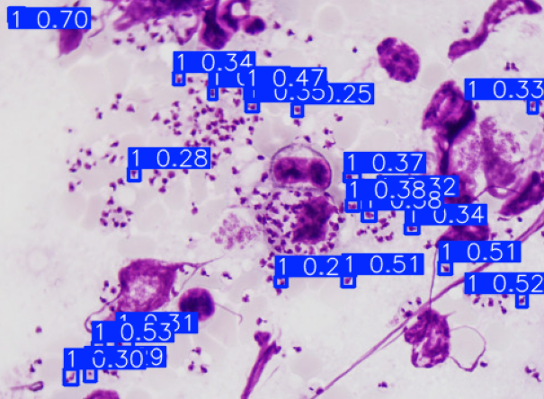
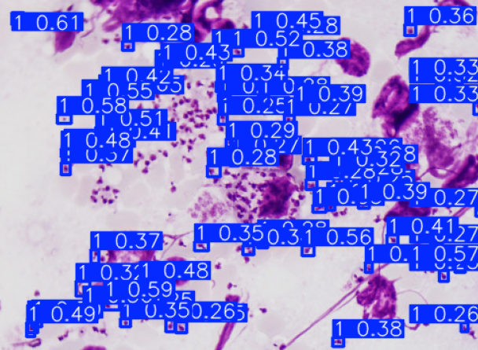
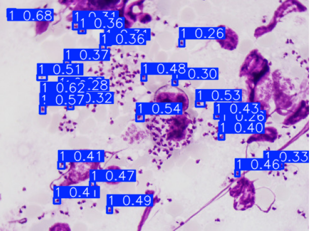

# Leishmania Parasite Detection

## **Abstract**

We aim to identify the Leishmania parasite, a species that can be transmitted from sandflies to animals and humans, using microscopic images. We will examine popular object detection models, including You Only Look Once (YOLO) and Region-based CNN models (R-CNN).

## **Data Description**

The data consists of 143 microscopic images, with each parasite labeled as a rectangle. The labels are stored in JSON files.

**Data Availability Statement: The data is confidential. (The cover image was obtained from Google)**

## Methods

### 1. YOLO - (code)

To achieve better results with the YOLO model, data augmentation has been attempted. One of these methods is chopping. By chopping the images, we increased the number of images in our dataset.

### 2. Faster R-CNN

Faster R-CNN is an advanced object detection algorithm that builds upon the R-CNN framework to improve speed and efficiency.

Images were resized while preserving the aspect ratio, and the model was trained with these resized images.

## **Conclusions**

In this study, while both models were capable of detecting parasites, the RCNN model demonstrated better performance compared to the various versions of the YOLO model, which yielded similar results.
| Model       | Maps     |
|-------------|----------|
| yolov10n    | 0.24476  |
| yolov5n     | 0.24488  |
| yolov8l     | 0.35519  |
| faster-rcnn | 0.9      |

### yolov10n Results: 

### yolov5n Results:

### yolov8l Results:

